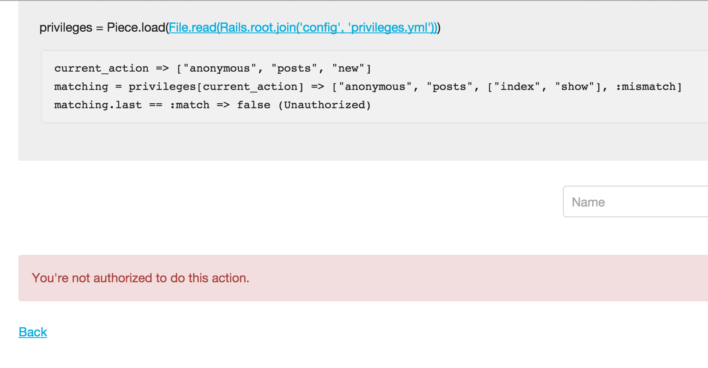

Piece Blog is an example Rails application
==================

This application is an example to show how [Piece](https://github.com/ThoughtWorksStudios/piece) works.

What this application does
------------------

This is a blog application:

1. Everyone can read any blog post.
2. Everyone can register as author to write and publish blog post.
3. To keep it simple and let you try out all roles, everyone can also register user as admin role.

Roles and permissions:

1. There are three types user: admin, author, anonymous
2. Admin user can do everything in application
3. Author can create, edit and delete blog post, but can't view/edit/delete user.
4. Anonymous user can read blog post and register new user.

Models and controllers:

1. We have 2 models and controllers: users and posts
2. Posts controller:
    1. Blog post CRUD
3. Users controller is controlling user
    1. User CRUD
    2. Login & logout user

Role based user privileges defined by rules
----------------

First, we need to design rules for privileges. In this application, we
can use role based access control to meet our goal.

Anonymous role is straightforward:

    anonymous:
      users: [login, logout, new, create]
      posts: [index, show]

Basically, we just specify what anonymous user can do using controller
and action names.

To define author role, we define another role named 'writer' first:

    writer:
      posts: '*'

('*' is wildcard char in Piece. It means matching all actions in the
above case.)

Then we can combine writer and anonymous role to get author role:

    author: writer + anonymous

Admin role is also simple:

    admin: '*'

In the writer role, we used "*" to match all actions in posts
controller. Here we use it to match all controllers and their actions.

Done. Combine them all together:

    writer:
      posts: '*'
    admin: '*'
    author: writer + anonymous
    anonymous:
      users: [login, logout, new, create]
      posts: [index, show]

We put them in config/privileges.yml

User role
------------------

Add role attribute to User model. We use string in this application,
and set it when created user.

    user.role

Authentication
------------------

Piece does not handle authentication. In this application we simply
set session[:current_user_id] when user types in correct user name.
And define current_user helper method in application_controller.rb:

    def current_user
      User.find_by_id(session[:current_user_id])
    end

Authorization
------------------

We can initialize Piece in config/application.rb

    config.privileges_yml = File.read(Rails.root.join('config', 'privileges.yml'))
    config.privileges = Piece.load(config.privileges_yml)

So in ApplicationController, we add:

    before_action :authorize

    ...

    private
    def authorize
      seq = Rails.configuration.privileges[current_action]
      if seq.last == :mismatch
        flash.now[:error] = "You're not authorized to do this action."
        render "layouts/401", status: :unauthorized
      end
    end

The `current_action` definition is matching how we define rules:

    def current_action
      [current_user.try(:role) || 'anonymous', controller_name, action_name]
    end

This method returns an Array with three elements matching to the
levels we defined in privileges YAML. First one is user role name, we
set it to 'anonymous' if there is no user logged in. Second and
third elements are controller name and action name.

When you call `Rails.configuration.privileges[current_action]`,
it returns you an array of matching sequence to explain why the
`current_action` matches or mismatches the rules we defined in
privileges.yml.
The last element in matching sequence is either `:match` or
`:mismatch`, which indicates whether current_action is authorized to
be performed.

Play it
--------------------

This application is designed to explain how Piece authorization works.
The following screenshot is showing why the request is unauthorized
when an anonymous user trying to create new post:

